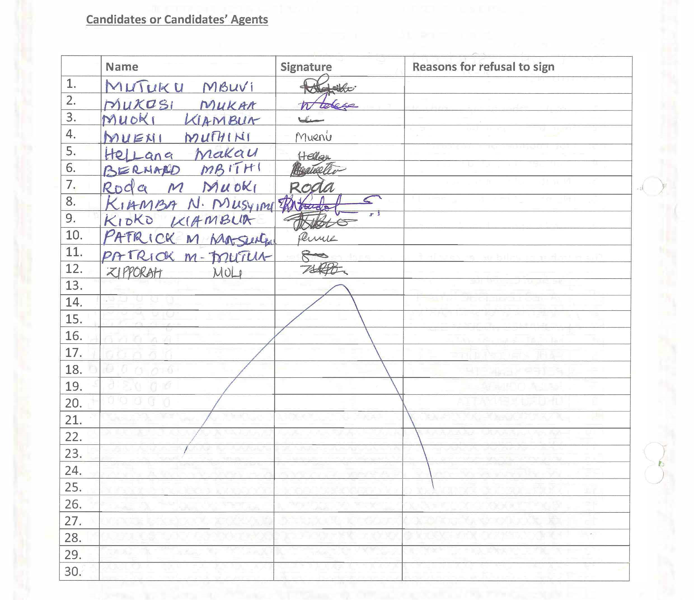

Kenya Form 34 Irregularities- Descriptive Statistics
================
SaewonPark
September 5, 2018

[create an
anchor](###-polling-station-and-constituency-information-section)

   

### Irregularities that affect the whole form

<!-- -->

   

-----

### Polling Station and Constituency Information Section

<!-- -->

   

<!-- -->

   

<!-- -->

   

-----

### Overall Voters, Ballots and Votes Section

   

<!-- -->

   

<!-- -->

   

<!-- -->

   

-----

   

### Votes per Candidate Section

   

<!-- -->

   

<!-- -->

   

<!-- -->

   

-----

   

### Presiding Officer & Deputy Presiding Officer Declaration Section

   

<!-- -->

   

#### Subsection 1: Declaration with polling station information

 

<!-- -->

   

<!-- -->
   

#### Subsection 2: Presiding Officer Information

 

<!-- -->

   

<!-- -->

   

#### Subsection 3: Deputy Presiding Officer Information

 

<!-- -->

   

<!-- -->

   

-----

   

### Agent Signature Section

   

<!-- -->

   

<!-- -->

   

-----

### Presiding Officer Comments Section

   

<!-- -->

   

<!-- -->

   

-----

-----

   

## All Sections of the Form

 
 

<!-- -->

-----

### Numbers of forms per polling station

<table class="table" style="width: auto !important; margin-left: auto; margin-right: auto;">

<caption>

Number of forms per constituency

</caption>

<thead>

<tr>

<th style="text-align:center;">

ConstName.2012

</th>

<th style="text-align:center;">

NUMBER\_OF\_FORMS

</th>

</tr>

</thead>

<tbody>

<tr>

<td style="text-align:center;">

KIBWEZI WEST

</td>

<td style="text-align:center;">

39

</td>

</tr>

<tr>

<td style="text-align:center;">

KHWISERO

</td>

<td style="text-align:center;">

38

</td>

</tr>

<tr>

<td style="text-align:center;">

KITUTU MASABA

</td>

<td style="text-align:center;">

38

</td>

</tr>

<tr>

<td style="text-align:center;">

LUNGA LUNGA

</td>

<td style="text-align:center;">

35

</td>

</tr>

<tr>

<td style="text-align:center;">

IJARA

</td>

<td style="text-align:center;">

32

</td>

</tr>

<tr>

<td style="text-align:center;">

KAJIADO EAST

</td>

<td style="text-align:center;">

29

</td>

</tr>

<tr>

<td style="text-align:center;">

EMBAKASI EAST

</td>

<td style="text-align:center;">

28

</td>

</tr>

<tr>

<td style="text-align:center;">

NAVAKHOLO

</td>

<td style="text-align:center;">

25

</td>

</tr>

<tr>

<td style="text-align:center;">

MAKADARA

</td>

<td style="text-align:center;">

25

</td>

</tr>

<tr>

<td style="text-align:center;">

SABOTI

</td>

<td style="text-align:center;">

19

</td>

</tr>

<tr>

<td style="text-align:center;">

JOMVU

</td>

<td style="text-align:center;">

12

</td>

</tr>

<tr>

<td style="text-align:center;">

KISAUNI

</td>

<td style="text-align:center;">

11

</td>

</tr>

<tr>

<td style="text-align:center;">

MASINGA

</td>

<td style="text-align:center;">

11

</td>

</tr>

<tr>

<td style="text-align:center;">

MT. ELGON

</td>

<td style="text-align:center;">

10

</td>

</tr>

<tr>

<td style="text-align:center;">

KIPIPIRI

</td>

<td style="text-align:center;">

9

</td>

</tr>

<tr>

<td style="text-align:center;">

CHANGAMWE

</td>

<td style="text-align:center;">

4

</td>

</tr>

<tr>

<td style="text-align:center;">

MATUGA

</td>

<td style="text-align:center;">

1

</td>

</tr>

<tr>

<td style="text-align:center;">

KINANGO

</td>

<td style="text-align:center;">

1

</td>

</tr>

<tr>

<td style="text-align:center;">

KILIFI NORTH

</td>

<td style="text-align:center;">

1

</td>

</tr>

<tr>

<td style="text-align:center;">

KALOLENI

</td>

<td style="text-align:center;">

1

</td>

</tr>

<tr>

<td style="text-align:center;">

TAVETA

</td>

<td style="text-align:center;">

1

</td>

</tr>

<tr>

<td style="text-align:center;">

MANDERA NORTH

</td>

<td style="text-align:center;">

1

</td>

</tr>

<tr>

<td style="text-align:center;">

KILOME

</td>

<td style="text-align:center;">

1

</td>

</tr>

<tr>

<td style="text-align:center;">

KAITI

</td>

<td style="text-align:center;">

1

</td>

</tr>

</tbody>

</table>
